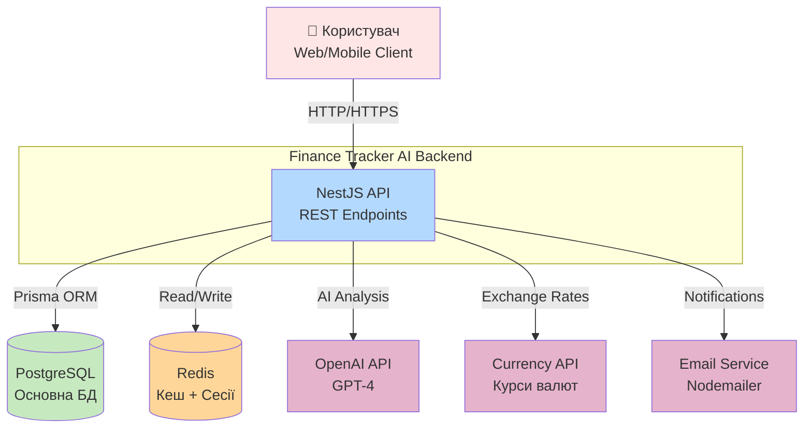
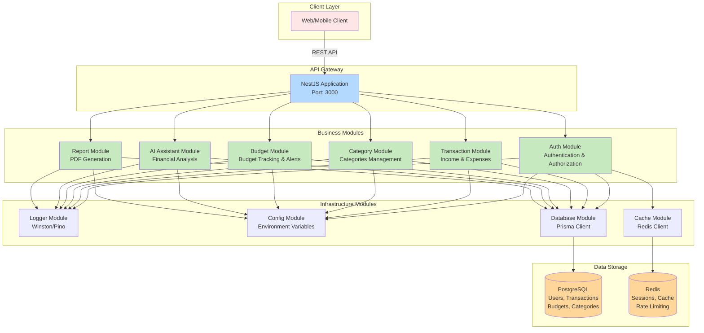
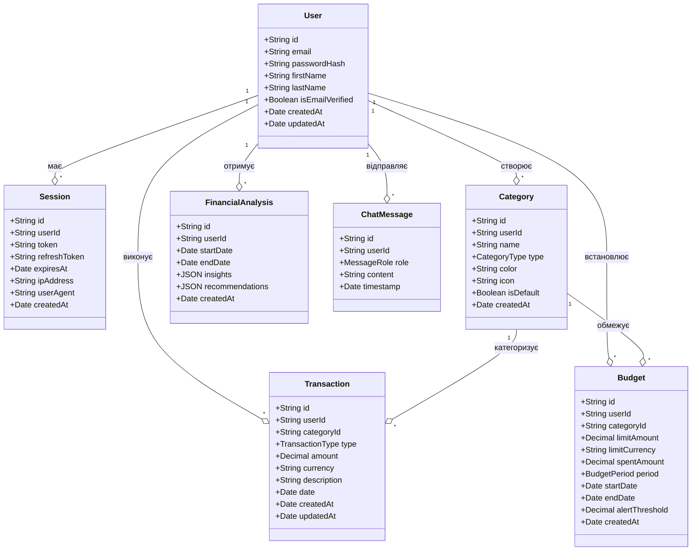
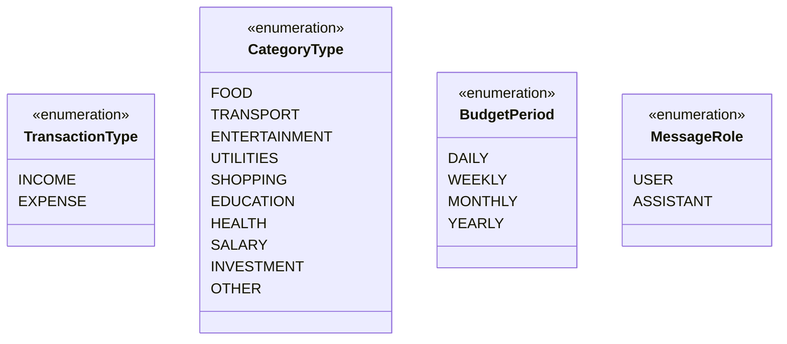
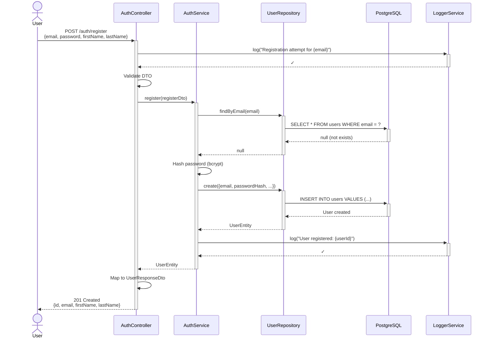
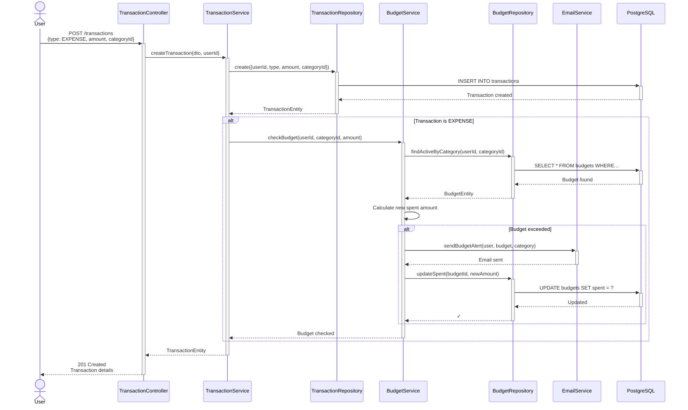
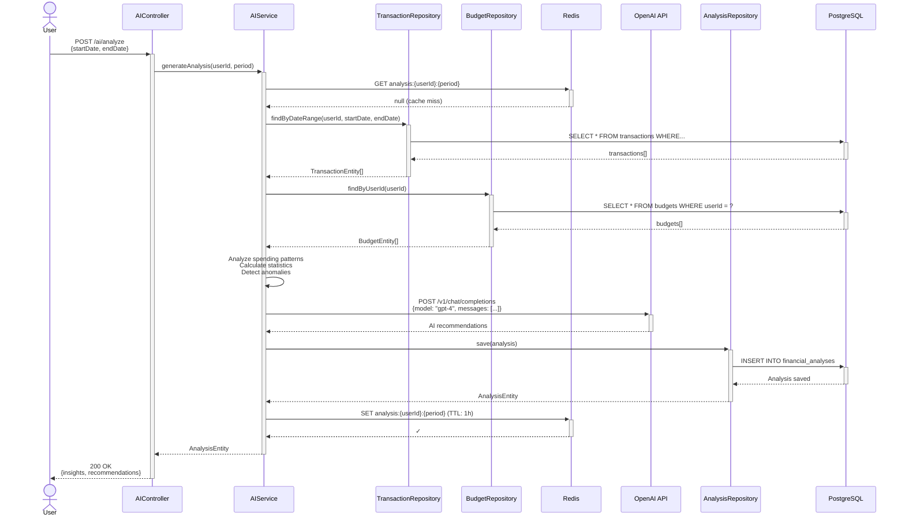
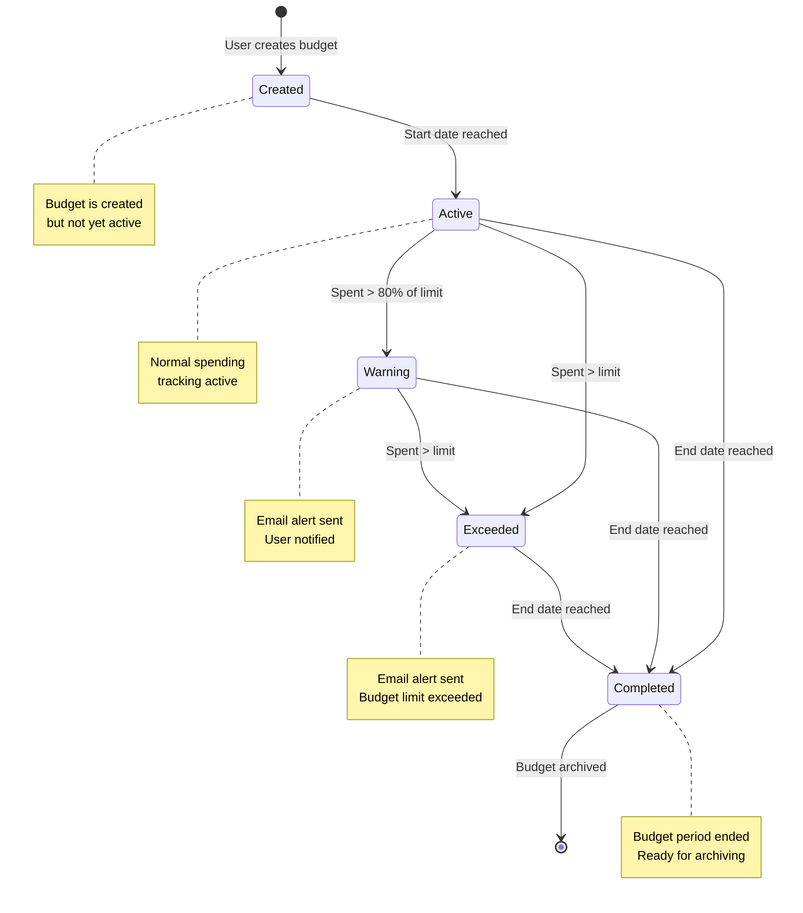

### 1. System Context Diagram (Діаграма контексту системи)

### 2.2. High-Level Architecture (Високорівнева архітектура)

### 2. Модулі системи

#### Бізнес-модулі (Business Modules):

1. **Auth Module** 
   - Реєстрація користувачів
   - Вхід в систему (JWT tokens)
   - Управління сесіями (Redis)
   - Верифікація email

2. **Transaction Module** 
   - CRUD операції з транзакціями
   - Фільтрація та пошук
   - Конвертація валют
   - Історія операцій

3. **Category Module** 
   - Управління категоріями витрат/доходів
   - Дефолтні категорії
   - Користувацькі категорії
   - Статистика по категоріях

4. **Budget Module** 
   - Створення та управління бюджетами
   - Відстеження витрат
   - Автоматичні сповіщення (email)
   - Прогнозування витрат

5. **AI Assistant Module** 
   - Аналіз фінансової поведінки
   - Виявлення паттернів витрат
   - Генерація рекомендацій (OpenAI GPT-4)
   - Чат-інтерфейс для питань

6. **Report Module** 
   - Генерація PDF звітів
   - Статистика за період
   - Візуалізація даних

#### Інфраструктурні модулі (Infrastructure Modules):

7. **Logger Module** 
   - Структуроване логування (Winston/Pino)
   - Різні рівні логування (error, warn, info, debug)
   - Збереження логів у файли

8. **Config Module** 
   - Управління environment змінними
   - Валідація конфігурації
   - Типобезпечний доступ до налаштувань

9. **Database Module** 
   - Prisma Client для PostgreSQL
   - Міграції схеми бази даних
   - Connection pooling

10. **Cache Module** 
    - Redis client для кешування
    - Управління сесіями
    - Rate limiting

### 2.4. Протоколи та інтерфейси взаємодії

| Взаємодія | Протокол | Формат даних |
|-----------|----------|--------------|
| Client ↔ API | HTTP/HTTPS (REST) | JSON |
| API ↔ PostgreSQL | TCP (Prisma) | SQL |
| API ↔ Redis | TCP (ioredis) | Key-Value |
| API ↔ OpenAI | HTTPS (REST) | JSON |
| API ↔ Currency API | HTTPS (REST) | JSON |
| API ↔ Email | SMTP | Email |

---

## 3. Деталізоване проектування компонентів

### 3.1. Class Diagram - Domain Model (Діаграма класів - Доменна модель)

**Пояснення відносин:**
- `User` є центральною сутністю системи
- Один `User` може мати багато `Transaction`, `Budget`, `Category`
- `Transaction` належить до однієї `Category`
- `Budget` встановлюється для однієї `Category`

#### Enums (Перерахування):

### 3.2. Sequence Diagram - User Registration (Діаграма послідовності - Реєстрація користувача)

### 3.3. Sequence Diagram - Create Transaction with Budget Check (Діаграма послідовності - Створення транзакції з перевіркою бюджету)

### 3.4. Sequence Diagram - AI Financial Analysis (Діаграма послідовності - AI аналіз фінансів)

### 3.5. State Diagram - Budget Lifecycle (Діаграма станів - Життєвий цикл бюджету)

